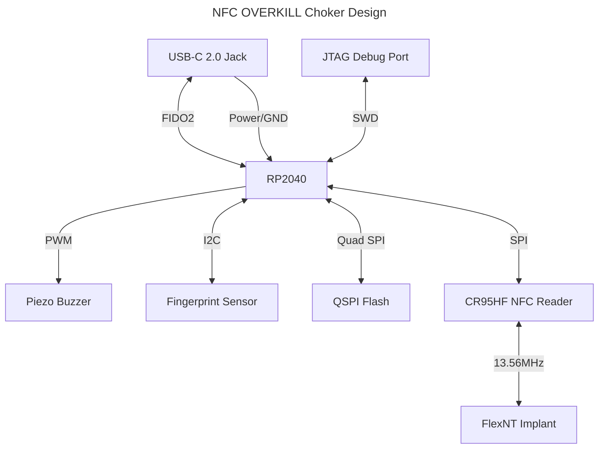

# On Micro-Blogging {#on-blogging}

## On Implants and Wearables (2026-01-25) {#on-implants-and-wearables}

I have multiple implants (`adora`, a [NEXTv2](https://dangerousthings.com/product/next-v2/), and `entrapta`, an [xG3](https://dangerousthings.com/product/xg3/)) and one wearable (`pythia`, a Fitbit Inspire 3). Of course, I'm planning on getting more---short term plans include a [CoM conversion](https://dangerousthings.com/product/conversion/) for tap-to-pay and a [FlexNT](https://dangerousthings.com/product/flexnt/) for reasons I will discuss below, and in the longer term I plan on getting a [BodyBytes implant](https://forum.dangerousthings.com/t/bodybytes-implant/12270/126) in my leg (also to be discussed below). However, from an engineering design perspective, I think having implants and wearables work together is an interesting concept I'd like to explore.

### Implants Alone

An implant alone, with the current state of the art, is not a super useful thing. Sure, being able to present an NFC chip or payment module in my hand is a neat party trick, and magnets help me carry screws and small ferromagnetic parts, but on the whole, the problem of *powering it* means that without an external device to accompany, most implants cannot do anything on their own.

### Smart Implant, Dumb Wearable

What about pairing a "smart" implant with a "dumb" wearable, which would provide only power? An example of this is found in the *BodyBytes* implant mentioned earlier, which is an OpenWrt wireless access point that can be implanted in the leg and used as a file server. It has no power source of its own, and requires an external Qi battery mounted near it (for example, attached to a garter or holster) to function. This allows it to work continuously, but the implant itself is large, expensive, and requires a high level of skill to implant (though, knowing its creators, such skill is definitely available).

### Dumb Implant, Smart Wearable

Another compromise can be found by pairing a relatively "dumb" implant with a "smart" wearable; that is, the implant only stores data, with power *and* computation occurring on the wearable. For example, a current (extremely early stage, possibly infeasible) project I'm workshopping involves pairing a flexible NFC implant placed under my neck tattoo with a choker that can act as a FIDO2 device, allowing me to split credentials between the implant and the choker and use them for authentication (such as for SSH or OpenID Connect). This would result in a cheap implant and a simple wearable that can together perform a complex function. However, without the wearable, the implant itself is useless (possibly a brick, if credentials are split using XOR, encryption, or Shamir secret sharing).

### Engineering Design

It all comes down to engineering design: it makes sense in many cases to have the implant itself be smart with the wearable being "dumb"; the reverse can be just as true. The engineering requirements should always drive the design decisions, not the other way around.